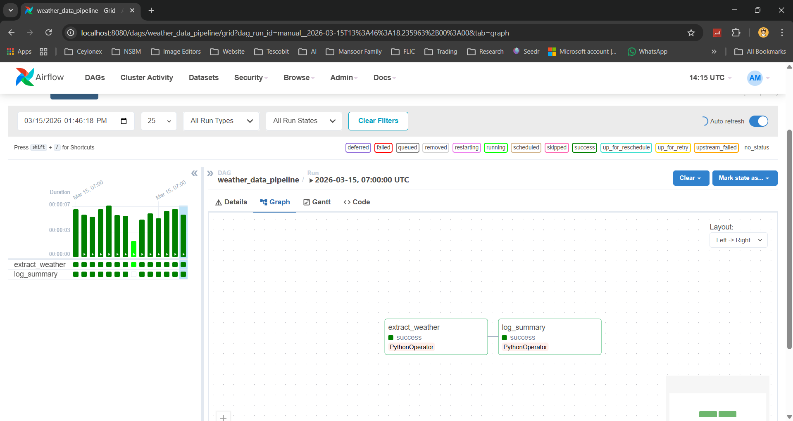
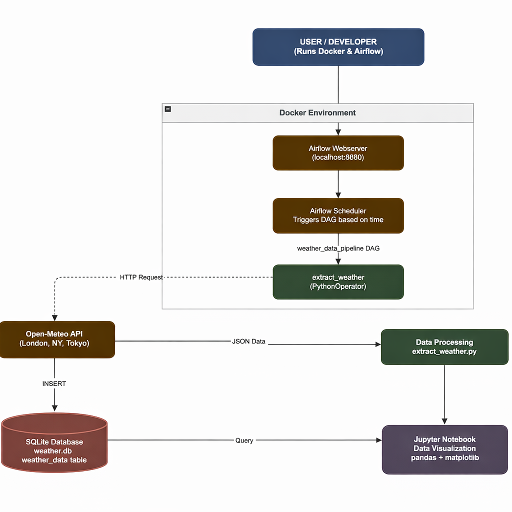
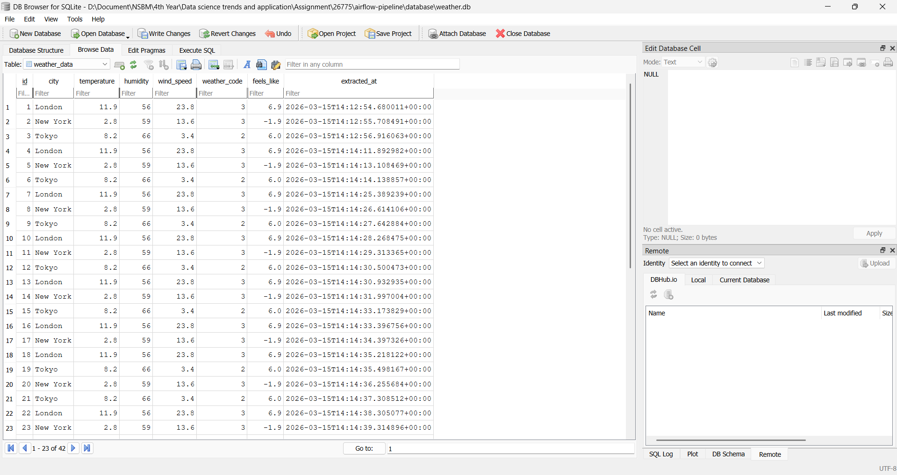

# 🌦️ Weather Data Pipeline — Apache Airflow + Docker

A complete data pipeline that automates weather data extraction, processing, and storage using Apache Airflow and Docker.

---

## 📌 Project Overview

This project demonstrates an automated workflow using Apache Airflow to fetch real-time weather data from the Open-Meteo API and store it in a SQLite database. The pipeline is scheduled daily and monitored through the Airflow UI.

---

## ⚙️ Technologies Used

* Apache Airflow
* Python
* Docker & Docker Compose
* SQLite
* Open-Meteo API

---

## 🚀 How to Run

```bash
docker compose up -d
```

👉 Open Airflow UI: http://localhost:8080

**Login:**

* Username: `admin`
* Password: `admin`

---

## ▶️ Running the Pipeline

* Enable DAG: `weather_data_pipeline`
* Click **Trigger DAG**
* Monitor execution in Graph View

---

## 🔄 Pipeline Workflow

Airflow Scheduler → DAG → Python Script → API → Database

---

## 🖼️ System Screenshots

---

### 🔹 DAG Graph View



---

### 🔹 Pipeline Overview



---

### 🔹 Database Output



---

## 📈 Features

* Automated daily scheduling
* Real-time workflow monitoring
* Containerized deployment

---

## 👨‍💻 Author

**Mohamed Ajmal**

---

## 📄 License

This project is for academic purposes.
